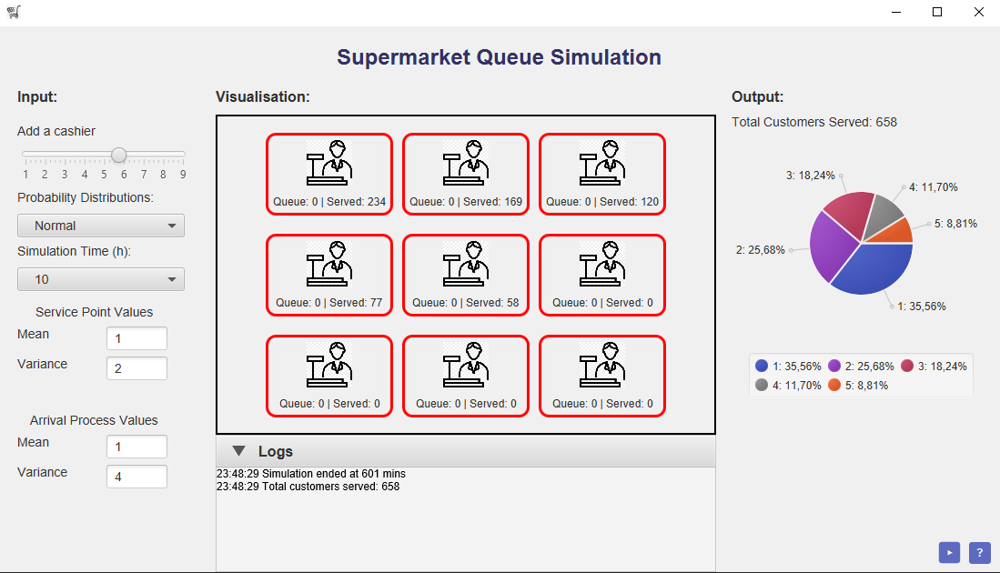
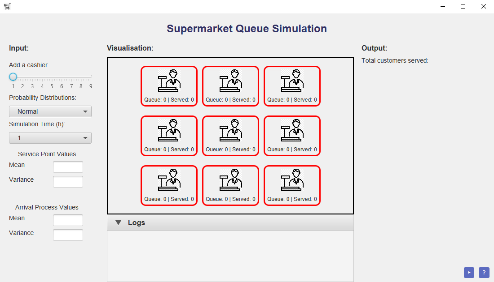
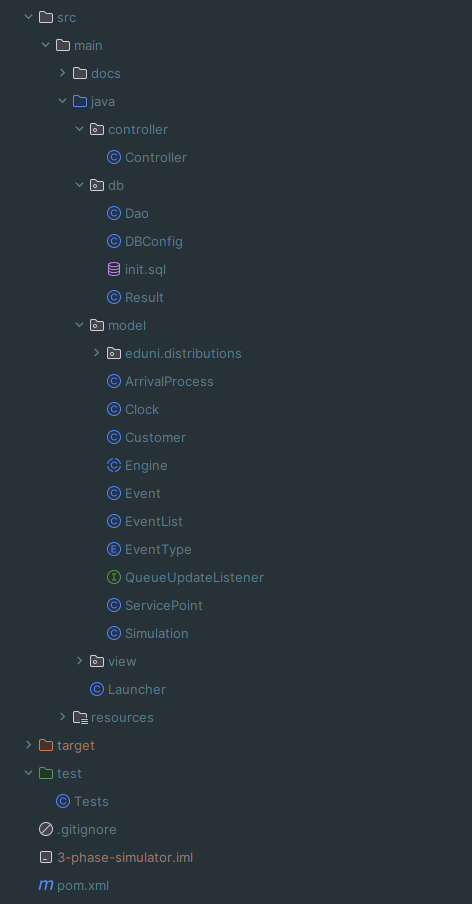
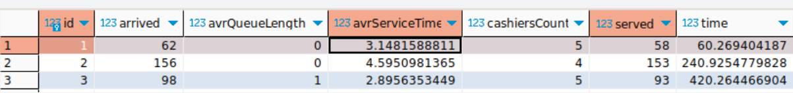

# Supermarket Queue Simulation (3-phase simulation)



This is a Maven-based Java project for simulating 3-phase systems.
This project models queue behavior in supermarkets using The University of Edinburgh [distributions package](https://www.dcs.ed.ac.uk/home/simjava/distributions/doc/eduni/distributions/package-summary.html),
providing a comprehensive environment for simulating and managing supermarket queues.

- [Description](#description)
  - [GUI](#gui)
  - [Internal Logic](#internal-logic)
  - [External Data Repositories](#external-data-repositories)
  - [Architecture](#architecture)
  - [Demo](#demo)
  - [Testing](#testing)
  - [Javadoc](#Javadoc)
- [Installation](#installation)
  - [Prerequisites](#prerequisites)
  - [Steps](#steps)
  - [Execution](#execution)
- [License](#license)
- [Authors](#authors) <br>

## Description


The project utilizes Java programming to model queue behavior in supermarkets, integrating several key technologies and tools for development, testing, and management. <br>
These include:

- **Java**: Forms the foundation of the application.
- **Maven**: Key tool for managing dependencies and automating build lifecycle.
- **JavaFX**: Used for creating the user interface.
- **JUnit 5**: Testing framework for ensuring reliability.
- **Hibernate**: ORM tool for simplifying database operations.
- **MariaDB**: Database for storing simulation results.

## GUI

The GUI of the Supermarket Queue Simulation is constructed using FXML and the `View` class,
where the FXML file describes the layout and structure of the user interface. <br>
The manipulation of data and dynamic changes in the GUI are handled by the `Controller` class.

The GUI of the application looks like this:



## Internal Logic

The project includes logic for managing the supermarket queue simulation:

- Dynamic and selectable number of service points (cashiers).
- Tracking of all arrived customers.
- Logic for customers to search for the cashier with the shortest queue.
- Method to save simulation results to the database.

## External Data Repositories

Object relational mapping is used to manage data repositories. <br>
The project includes a dedicated `Result` class for database-related information from the simulation, along with separate `DBConnection` and `Dao` classes.

## Architecture

The project follows the MVC model for structuring, ensuring it's understandable, maintainable, and scalable. <br>
Classes are grouped into relevant packages, including separate packages for database, documentation, and tests. <br>
[Javadoc](https://users.metropolia.fi/~andriid/simulation_javadoc/) provides documentation and description of each class and method in the project.



## Demo

The user-friendly interface allows users to select parameters for simulation. <br>
Various [distributions](https://www.dcs.ed.ac.uk/home/simjava/distributions/doc/eduni/distributions/package-summary.html) have specific requirements for user input. <br>
Error handling (as shown in demo) ensures the backend is resilient to incorrect input. 

https://github.com/LVNDLORD/3-phase-simulator/assets/93579810/60d55567-46ad-47c5-abfa-7fb0618adacf

[Link](https://users.metropolia.fi/~andriid/simulation_vid/gif_demo.gif) to demo GIF (if video is not working).

Simulation results are saved in the database for future reference.



## Testing

Automated tests using JUnit5 cover queue operations, service operations, scenarios with multiple service points, <br>
and distribution characteristics. These tests ensure the reliability and accuracy of the simulation under diverse scenarios.

## Javadoc

Javadoc serves as documentation within the codebase, enhancing code readability. <br>
It categorizes documentation into key sections such as controllers, databases, models, and views, facilitating seamless development.

Link to [Javadoc](https://users.metropolia.fi/~andriid/simulation_javadoc/)


## Installation

### Prerequisites
- Maven <br>

Install Maven from your IDE or manually. <br> 
Here are [instructions](https://maven.apache.org/install.html) how to.

### Steps
1. Clone the repository:
    ```bash
    git clone https://github.com/your-username/3-phase-simulator.git
    ```
2. Navigate to the project directory:
    ```bash
    cd 3-phase-simulator
    ```
3. Install all dependencies:
    ```bash
    mvn dependency:resolve
    ```
4. Build the project using Maven:
    ```bash
    mvn clean package
    ```

## Execution
- Run the project using `Launcher` class.

## Authors
- [Andrii Deshko](https://github.com/LVNDLORD)
- [Anna Lindén](https://github.com/AnnaLinden)
- [Sergio Soares](https://github.com/SoaresPT)
- [Arman Yerkeshev](https://github.com/A-Yerkeshev)
